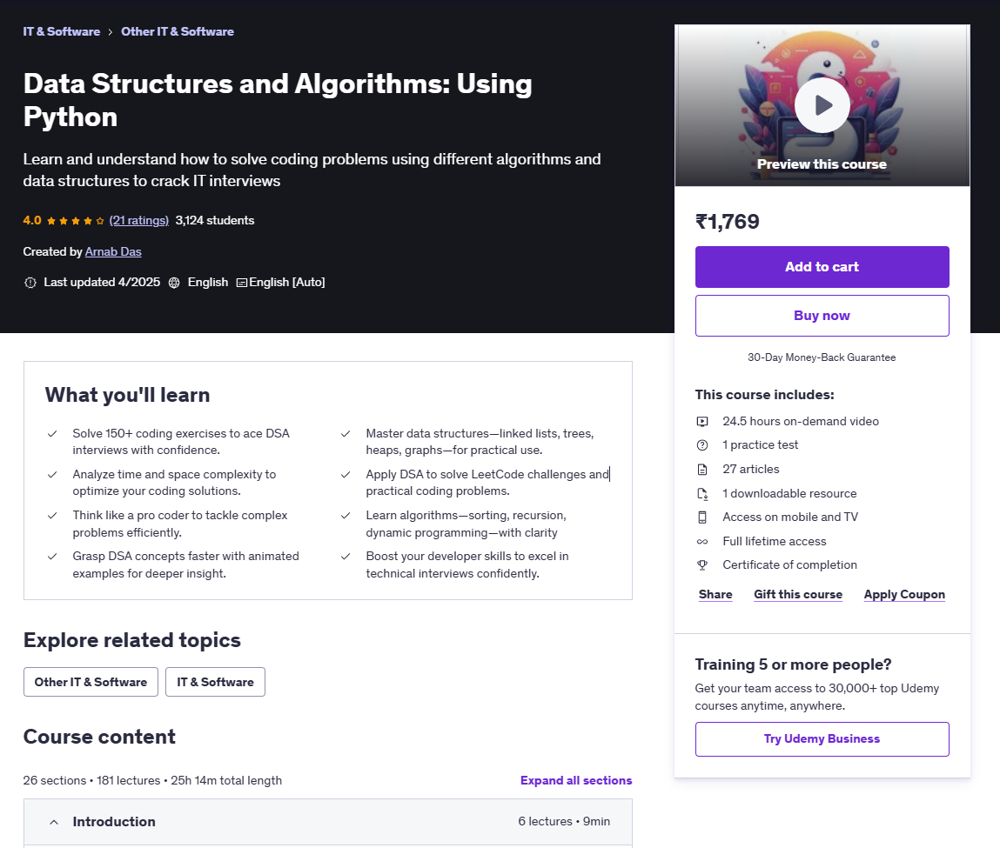

<h1 align="center"><a href="https://www.udemy.com/course/leetcode-top-150-interview-questions-with-python/"> Data Structures and Algorithms: Using Python </a></h1>

  

 

 

<h1 align="center"><a href="https://leetcode.com/u/raj713335/"> LeetCode Profile: </a></h1>

 

#### Development Stuff:

<b>&#128200; Competitive Programming⚡ Github Stats</b>

  
#### Connect With Me

  

  

  

